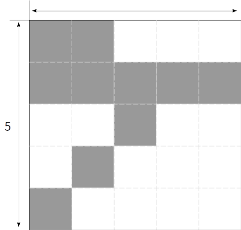
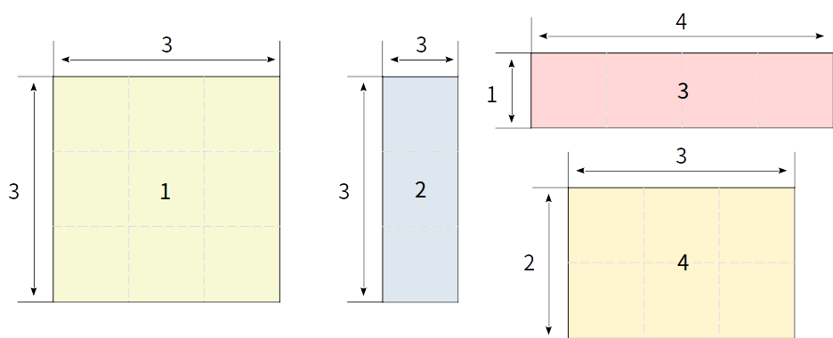
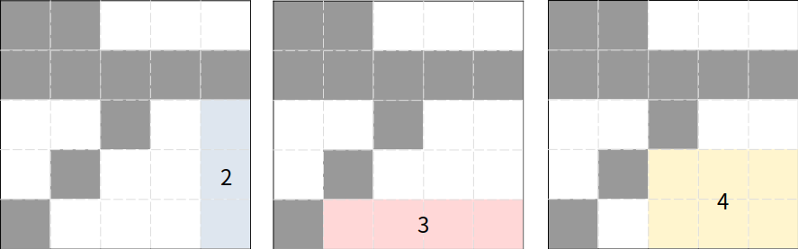

# 액자 놓기

## 문제

집 벽면을 액자들로 장식하는 것을 좋아하는 정현이는 오늘 새 액자를 하나 사서 벽을 장식하려고 한다. 그렇게 정현이는 오늘 하루종일 쿠X에서 맘에 드는 여러 액자들을 골라 장바구니에 담았고, 정현이는 이 액자들 중에서 하나만 구입하여 벽에 걸려고 한다. (여기에서, 액자와 벽은 직사각형 모양이고, 액자를 벽에 걸 때는 항상 벽의 가로축과 액자의 가로축이 평행하도록 배치한다. 또한 액자들은 서로 겹치지 않는다.)

그런데 실컷 장바구니에 담고 생각해보니, 이미 벽에 걸린 액자가 많기 때문에 벽에 남은 공간이 한정적이라는 점을 깨달았다. 다시 말해서, 장바구니에 넣은 수많은 액자들 중 크기가 작아 벽에 걸 수 있는 것도 있고, 크기에 비해 여유 공간이 없어서 벽에 걸 수 없는 것도 있다는 것이다.

그래서 정현이는 장바구니에 담은 액자들 중 벽에 놓을 수 있는 것들을 골라내고자 한다. 정현이를 위해 벽에 놓을만한 여유 공간이 있는 액자들의 목록을 구해내는 알고리즘을 작성하시오.

예를 들어, 벽의 가로 크기와 세로 크기가 모두 5인 벽이 아래와 같은 상태라고 하자. 회색으로 칠해진 부분은 이미 다른 액자가 있어서 다른 액자를 놓을 수 없는 위치이다.


<div style="text-align:center"></div>

그리고 정현이의 장바구니에 있는 4가지의 액자가 아래와 같은 크기라고 하자.

<div style="text-align:center"></div>

그렇다면 1번 액자는 어느 위치에 놓더라도 이미 있는 액자와 겹치게 되므로 벽에 놓을 수 없고, 나머지 2, 3, 4번 액자는 놓을 수 있는 위치가 존재한다. 따라서 이 예시에서는 놓을 수 있는 액자의 개수가 3개이고, 그것들의 목록은 2, 3, 4이다. 아래는 2, 3, 4번 액자 각각을 벽에 건 예시이다.

<div style="text-align:center"></div>

(위의 그림에서 2, 3, 4번이 겹치는 영역이 있지만 이는 문제가 되지 않는다. 왜냐하면 문제에서 언급한 것처럼 정현이는 장바구니의 액자들 중 단 하나만 구입할 것이기에, 각 액자를 놓을 수 있는지 여부만 중요하기 때문이다.)

## 입력

첫째 줄에 벽의 가로 길이 $W$, 벽의 세로 길이 $H$, 장바구니에 있는 액자의 개수 $N$이 공백으로 구분되어 주어진다. $(1 \leq W \leq 10^{3}, 1 \leq H \leq 10^{3}, 1 \leq N \leq 10^{5})$

둘째 줄부터 $H$줄에 걸쳐 벽의 상태가 문자열로 주어진다. 각 줄은 $W$개의 문자로 이루어져있으며, 'X'은 액자를 놓을 수 없는 칸, '.'은 액자를 놓을 수 있는 칸을 의미한다.

그 이후 총 $N$줄에 걸쳐 각 액자의 크기가 $1$번 액자부터 $N$번 액자까지 한 줄씩 나누어 주어진다. 여기에서 한 줄로 주어지는 한 액자의 크기는 액자의 가로 길이 $a$, 세로 길이 $b$가 공백으로 구분되어 주어진다. $(1 \leq a \leq W, 1 \leq b \leq H)$

## 출력

첫째 줄에 벽에 놓을 수 있는 액자의 개수를 출력한다.

첫째 줄에 출력한 액자의 개수가 1개 이상이라면, 둘째 줄에 벽에 놓을 수 있는 액자들의 번호를 공백으로 구분하여 오름차순으로 출력한다.

## 예제 입력 1

```
5 5 4
XX...
XXXXX
..X..
.X...
X....
3 3
1 3
4 1
3 2
```

## 예제 출력 1

```
3
2 3 4
```

## 예제 입력 2
```
4 3 3
....
.XX.
....
2 2
2 3
3 2
```

## 예제 출력 2
```
0
```