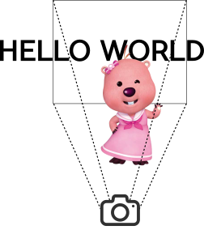

# 사진 찍어주세요!

시간 제한  : 1초 / 메모리 제한 : 1024MB

## 문제

루피는 서울로 관광여행을 왔다. 루피는 처음으로 서울에 온 기념으로 자신이 원하는 단어가 뒤에 나오는 사진을 찍고 싶다. 하지만 루피는 길거리에서 아무리 찾아봐도 원하는 단어를 찾지 못해서 매우 화가 났다.

화난 루피는 당신을 붙잡았다. 당신은 루피를 도와서 원하는 단어가 뒤에 오도록 사진을 찍어야한다. 똑똑한 당신은 길거리에 원하는 단어가 없을지라도 원하는 단어가 뒤에 오도록 사진을 찍는 방법을 알고있다. 그 방법은 다음과 같다.

1. 단어의 중간 부분을 루피의 얼굴로 가려버린다. 루피가 앞뒤로 움직여서 단어의 전체를 가릴 수도 있고 단어를 전혀 가리지 않을 수도 있다.
2. 그리고 한 직사각형 영역의 사진을 찍는다. 단어의 전체를 찍을 수도 있고 단어의 왼쪽 또는 오른쪽 끝의 일부가 나오지 않도록 사진을 찍을 수도 있다.

아래는 `HELLOWORLD`라는 문자열이 주어졌을 때 `LOL`이 뒤에오도록 사진을 찍는 예이다.




주어진 문자열을 루피가 원하는 단어가 뒤에 오도록 사진을 찍을 수 있는지 판별하는 프로그램을 작성해보자.

## 입력

첫째 줄에 문자열 S의 길이 N이 주어진다. (1 ≤ N ≤ 5,000)

둘째 줄에는 문자열 S가 주어진다. 문자열 S는 공백 없이 알파벳 대문자로만 이루어져있다.

셋째 줄에 루피가 원하는 단어 T의 길이 M이 주어진다. (1 ≤ M ≤ N)

넷째 줄에는 루피가 원하는 단어 T가 주어진다. 루피가 원하는 단어 T는 공백 없이 알파벳 대문자로만 이루어져있다.

## 출력

문자열 S를 루피가 원하는 단어 T로 만들 수 있으면 `YES`를 출력한다. 만약 만들 수 없다면 `NO`를 출력한다.

### 예제 입력 1

```
10
HELLOWORLD
3
LOL
```

```
YES
```

### 예제 입력 2

```
10
HELLOWORLD
4
HELL
```

```
YES
```

### 예제 입력 3

```
14
WELCOMETOKOREA
2
GO
```

```
NO
```

