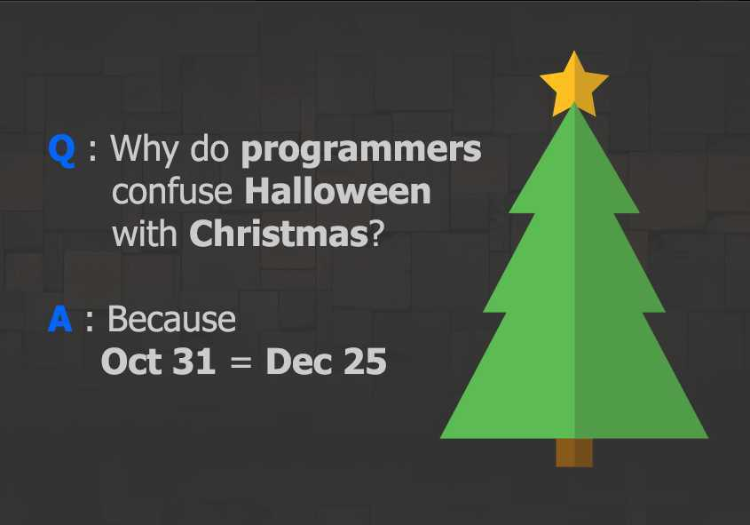

# 우리가 할로윈과 크리스마스를 혼동하는 이유

시간 제한 : 1초 / 메모리 제한 : 1024MB

## 문제



[출처 : facebook](https://www.facebook.com/programminggeeks.in/photos/a.662730397199553/1028262260646363/)


> 프로그래머가 할로윈과 크리스마스를 혼동하는 이유 아는가?
>
> 그것은 8진수(Oct)로 나타낸 31을 10진수(Dec)로 바꾸면 25가 되기 때문이다!


이처럼 10진수로 표현된 문자열 S와 T가 있을 때, S를 a진수로 해석한 a진수값과 T를 b진수로 해석한 b진수값이 같으면 이 기수(base)쌍 (a, b)를 `confused pair`라고 하자. 이 문제에서는 2 이상 10 이하의 기수(base)에 대해서만 생각한다. (2 <= a, b <= 10)


예를 들어서 31과 25의 `confused pair`를 구해보자. (S = "31", T = "25")

31을 해석할 수 있는 2 이상 10 이하의 기수(base)는 {4, 5, 6, 7, 8, 9, 10}이다.

25를 해석할 수 있는 2 이상 10 이하의 기수(base)는 {6, 7, 8, 9, 10}이다.

최종적으로 `confused pair`를 구해보면 (6, 7)과 (8, 10)이다.


두 문자열이 주어졌을 때 `confused pair`의 갯수를 구하는 프로그램을 작성해보자.


## 입력

10진수로 표현된 문자열 S와 T가 공백을 두고 주어진다. 문자열의 길이는 1보다 크거나 같고 8보다 작거나 같다.

각 문자열은 0으로 시작하지 않는다. 그리고 0 하나로 이루어진 문자열은 입력으로 주어지지 않는다.

## 출력

두 문자열 S와 T에 대한 `confused pair`의 갯수를 출력한다. 이 문제에서는 2 이상 10 이하의 기수(base)에 대해서만 생각한다.


### 예제 입력 1

```
31 25
```

### 예제 출력 1

```
2
```

### 예제 입력 2

```
55 55
```

### 예제 출력 2

```
5
```

