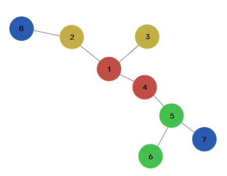

# CUTTER!

시간 제한  : 2초 / 메모리 제한 : 1024MB

## 문제

그래프 이론에서 트리(tree)의 정의는 사이클이 없는 연결 무향 그래프를 말한다. 트리에서 리프(leaf) 노드는 단말 노드라고도 부르며 차수가 1인 노드를 말한다.

다음과 같은 트리 T가 주어진다.

- T의 각 노드에는 색깔이 있다. 편의상 노드의 색깔은 양의 정수로 나타낸다.
- T의 노드의 수는 짝수이다.
- 어떤 색깔을 가지고 있는 노드는 무조건 한쌍이다. 한개의 노드만 유일한 색깔을 가지고 있거나 3개 이상의 노드가 같은 색깔을 가지지 않는다.
- 색깔이 같은 리프 노드가 있으면 그 리프 노드를 잘라낼 수 있다.

이러한 트리 T에서 리프 노드를 최대한 잘랐을 때 트리에 남은 노드를 출력하는 프로그램을 작성해보자.


## 입력

첫번째 줄에 노드의 수 N이 주어진다. (2 ≤ N ≤ 300,000)

두번째 줄에 N개의 노드의 색깔 c_i가 주어진다. (1 ≤ c_i ≤ 1,000,000,000)

세번째 줄부터 N-1개의 줄에는 i번 간선이 연결하는 두 노드의 번호 u_i와 v_i가 주어진다. (1 ≤ u_i, v_i ≤ N)


## 출력

첫번째 줄에 트리에서 리프 노드를 최대한 잘랐을 때 트리에 남은 노드의 수를 출력한다.

두번째 줄에 트리에 남은 노드의 번호를 오름차순으로 출력한다.


### 예제 입력 1

```
8
1 5 5 1 7 7 9 9
1 4
1 2
1 3
4 5
5 6
5 7
2 8
```

### 예제 출력 1

```
4
1 4 5 6
```

### 예제 입력 2

```
4
1 1 2 2
1 2
2 3
3 1
```

### 예제 출력 2

```
0
```


## 힌트



예제 입력 1의 트리를 예를 들어보자.

1. 초기에 잘라낼 수 있는 노드는 7번 노드와 8번 노드이다. 두 노드는 색깔이 같은 리프 노드이기 때문이다.
2. 8번 노드가 잘리면 2번 노드도 리프 노드가 된다. 같은 방식으로 2번 노드와 3번 노드를 잘라낼 수 있다.
3. 이제 남은 노드 중에서는 잘라낼 수 있는 노드는 없다.